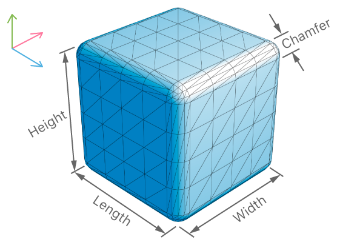
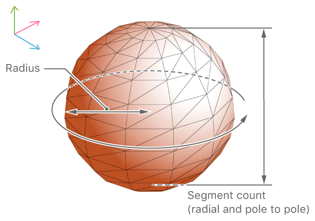
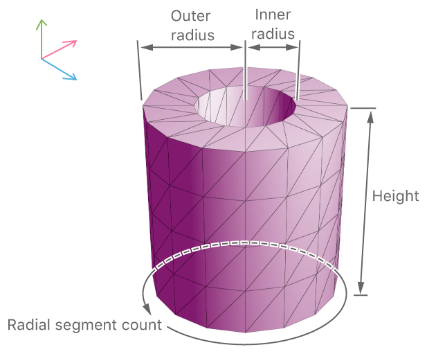

API
===

[🔙](../README.md)

- [add*](#add)
- [addModel](#addmodel)
- [addBox](#addbox)
- [addSphere](#addsphere)
- [addTube](#addtube)
- [addText](#addtext)
- [isSupported](#issupported-static)
- [grabScreenshot](#grabScreenshot-ios)

## `add*`
Shared properties of all `add*` functions are:

#### `position`


Looking at the image above, you can see the `0,0,0` coordinate is your device (not the floor),
and for instance, if you want to place an object in front of you, pass in a negative `z` value (in meters).

```typescript
position: ARPosition = {
  x: number,
  y: number,
  z: number
}
```

#### `scale` (optional)
This can either be a `number` or an `ARScale`:

```typescript
// either a number..
scale: number = 2.5;

// .. or an ARScale
scale: ARScale = {
  x: number,
  y: number,
  z: number
}
```

#### `rotation` (optional)
If you're not happy with the default placement of an object,
you can rotate it by a certain amount of degrees (0 - 360) relative to the x, y, and z axes.

For instance, if the backside of the model is facing you, setting y to `180` will make the front face you.

```typescript
rotation: ARRotation = {
  x: number,
  y: number,
  z: number
}
```

#### `mass` (optional)
By default objects don't have a mass so they're not subject to gravity and don't 'fall'.

If you want the object to fall you may also want to increase the `position.y` (for a higher drop).

```typescript
mass: number = 0.1;
```

## `addModel`
You can add 3D models to the AR scene by passing in `ARAddModelOptions` to the `addModel` function.
ARKit supports `.dae` files as used in our demo app, but you may need to clean up the model a bit so
it's properly shown. [Google a bit](https://www.google.nl/search?q=arkit+dae) for details.

Here are a few nice resources for `.dae` models:
- [Free3D.com](https://free3d.com/3d-models/all/1/dae)
- [Turbosquid.com, free](https://www.turbosquid.com/Search/Index.cfm?keyword=&search_type=free&media_typeid=2&file_type=194&=true&sort_column=A8&sort_order=desc)
- [Turbosquid.com, all](https://www.turbosquid.com/Search/Index.cfm?keyword=&media_typeid=2&file_type=194&=true&sort_column=A8&sort_order=desc)

```typescript
import { ARNode } from "nativescript-ar";

// assuming you have an 'ar' instance from either an event's 'object' property, or simply 'new AR()'.
ar.addModel({
  name: "Models.scnassets/Ball.dae", // refers to a file in App_Resources, see the demo app for examples
  childNodeName: null, // optional; if you only need 1 node within the model, then set its name here
  position: {
    x: 1,
    y: 1,
    z: 1
  },
  scale: 0.25,
  mass: 0.2,
  rotation: {
    x: 0,
    y: 180,
    z: 0
  },
  onTap: (model: ARNode) => console.log("Model was tapped"),
  onLongPress: ((model: ARNode) => {
    console.log("Model was longpressed, removing it just for show.");
    model.remove();
  })
}).then(arNode => {
  // to remove the model after a few seconds, you can do this:
  setTimeout(() => {
    arNode.remove();
  }, 2000);
});
```

## `addBox`
You can add a basic shape, like a box, to the AR scene by passing in `ARAddBoxOptions` to the `addBox` function.
By default boxes are white, but you can pass in a texture to make it look pretty.



Note that the `materials` array can be specified in a number of ways.
Its contents are either of type `string` (referring to an image), `Color`, or `ARMaterial`.
See the TS definitions and these examples for details.

```typescript
import { ARNode } from "nativescript-ar";

ar.addBox({
  position: {
    x: 1,
    y: 1,
    z: 1
  },
  dimensions: {
    x: 0.25,
    y: 0.25,
    z: 0.25
  },
  chamferRadius: 0.01, // 'rounded corners', this is relative to the 'dimensions'.
  mass: 0.2,
  materials: ["Assets.scnassets/Materials/tnsgranite/tnsgranite-diffuse.png"], // must be in App_Resources
  onTap: (model: ARNode) => console.log("Box was tapped"),
  onLongPress: (model: ARNode) => console.log("Box was longpressed")
}).then(arNode => console.log("Box was added"));
```

## `addSphere`


```typescript
import { ARNode } from "nativescript-ar";
import { Color } from "tns-core-modules/color";

ar.addSphere({
  position: {
    x: 1,
    y: 1,
    z: 1
  },
  radius: 0.5,
  segmentCount: 100,
  mass: 0.001,
  materials: [new Color("red")],
  onTap: (model: ARNode) => console.log("Sphere was tapped"),
  onLongPress: (model: ARNode) => console.log("Sphere was longpressed")
});
```

## `addTube`


```typescript
import { ARNode } from "nativescript-ar";

ar.addTube({
  position: {
    x: 1,
    y: 1,
    z: 1
  },
  innerRadius: 0.3,
  outerRadius: 0.5,
  height: 0.8,
  radialSegmentCount: 80,
  radialSegmentCount: 4,
  mass: 0.001,
  materials: [{
    diffuse: {
      contents: "Assets.scnassets/Materials/tnsgranite/tnsgranite-diffuse.png",
      wrapMode: "Repeat" // which is the default, see ARMaterialWrapMode for other options
    },
    roughness: "Assets.scnassets/Materials/tnsgranite/tnsgranite-roughness.png",
    transparency: 1 // 0 - 1, where 1 is solid (which is the default)
  }],
  onTap: (model: ARNode) => console.log("Tube was tapped"),
  onLongPress: (model: ARNode) => console.log("Tube was longpressed")
});
```

## `addText`

```typescript
import { ARNode } from "nativescript-ar";
import { Color } from "tns-core-modules/color";

ar.addText({
  text: "{N}",
  position: {
    x: 2.7,
    y: -0.2,
    z: -5
  },
  scale: 0.1,
  depth: 1,
  materials: [new Color("blue")],
  rotation: {
    x: 40,
    y: 10,
    z: 10
  }
});
```

## `isSupported` (static)
Check whether or not the device is AR-capable.

#### JavaScript
```js
var AR = require("nativescript-ar").AR;
var supported = AR.isSupported();
```

#### TypeScript
```typescript
import { AR } from "nativescript-ar";
const supported = AR.isSupported();
```

## `grabScreenshot` (iOS)
Added in 0.5.0, currently iOS-only.

Grab whatever the camera is showing, and get back a native image (`UIImage` on iOS).
You can show it on-screen afterwards as [shown here, in the demo app](https://github.com/EddyVerbruggen/nativescript-ar/blob/49fe472b1d53461c51423182c46168e17dbe5b64/demo/app/main-view-model.ts#L32).


#### JavaScript
```js
var img = ar.grabScreenshot();
```

#### TypeScript
```typescript
const img = ar.grabScreenshot();
```
