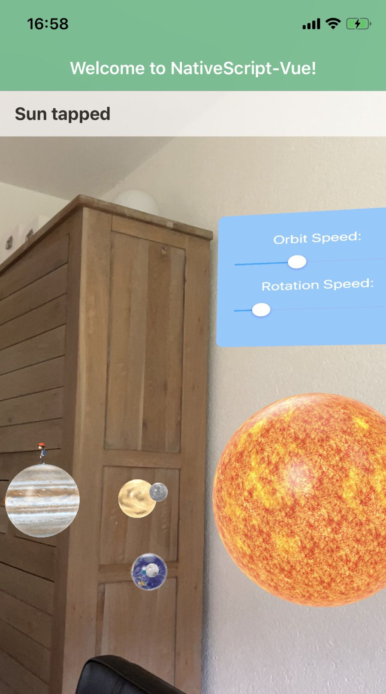

AR API
======

[🔙](../README.md)

The easiest way to obtain a reference to the `AR` object is by grabbing it from the `arLoaded` event you bind in the view:

```typescript
import { AR, ARLoadedEventData } from "nativescript-ar";

class MyModel {
  private ar: AR;

  public arLoaded(args: ARLoadedEventData): void {
    this.ar = args.object;
  }
}
```

Then call one of the 'add*' functions below, like `this.ar.addModel()`:

- [add*](#add)
- [addNode](#addnode)
- [addModel](#addmodel)
- [addBox](#addbox)
- [addPlane](#addplane)
- [addSphere](#addsphere)
- [addTube](#addtube)
- [addText](#addtext)
- [addImage](#addimage)
- [addVideo](#addvideo)
- [addUIView](#adduiview)

Once you added something to the scene, you'll get back an instance of `ARCommonNode` which supports a lot of features so you can interact with the node.
This object has a lot of properties and functions:

- [ARCommonNode properties](#arcommonnode-properties)
- [ARCommonNode functions](#arcommonnode-functions)

Oh, and you might want to check beforehand if AR or one of its features is supported:

- [isSupported](#issupported-static)
- [isImageTrackingSupported](#isimagetrackingsupported-static)
- [isFaceTrackingSupported](#isfacetrackingsupported-static)

.. or use one of the other functions supported by the plugin:

- [getCameraPosition](#getcameraposition)
- [trackImage](#trackimage)
- [grabScreenshot](#grabscreenshot-ios)

## `add*`

### Shared properties of all `add*` functions

#### `position` 


Looking at the image above, you can see the `0,0,0` coordinate is your device (not the floor),
and for instance, if you want to place an object in front of you, pass in a negative `z` value (in meters).

```typescript
position: ARPosition = {
  x: number,
  y: number,
  z: number
}
```

#### `parentNode`
Instead of adding a node relative to the camera, you can add it to another node that's already part of the scene.

We leverage this feature in the Solar System demo by [adding life to planets](https://github.com/EddyVerbruggen/nativescript-ar/blob/77d1d4585f0f92aa2d6f6de494c528f7895e2b28/demo-solarsystem/app/components/App.vue#L350).

#### `scale` (optional)
This can either be a `number` or an `ARScale`:

```typescript
// either a number..
scale: number = 2.5;

// .. or an ARScale
scale: ARScale = {
  x: number,
  y: number,
  z: number
}
```

#### `rotation` (optional)
If you're not happy with the default placement of an object,
you can rotate it by a certain amount of degrees (0 - 360) relative to the x, y, and z axes.

For instance, if the backside of the model is facing you, setting y to `180` will make the front face you.

```typescript
rotation: ARRotation = {
  x: number,
  y: number,
  z: number
}
```

#### `draggingEnabled`
Set this to `true` to enable moving objects around.

#### `rotatingEnabled`
Set this to `true` to enable rotating objects.

#### `scalingEnabled`
Set this to `true` to enable scaling of objects.

#### `mass` (iOS only)
By default objects don't have a mass so they're not subject to gravity and don't 'fall'.

If you want the object to fall you may also want to increase the `position.y` (for a higher drop).

```typescript
mass: number = 0.1;
```

### Shared functions of all `add*` functions

#### `onTap`

```typescript
import { ARNodeInteraction } from "nativescript-ar";

onTap: (interaction: ARNodeInteraction) => {
  console.log("A node was tapped at coordinates " + interaction.touchPosition.x + " x " + interaction.touchPosition.y);
  // as an example, here's how to rotate that node 5 degrees to the right:
  interaction.node.rotateBy({
    x: 0,
    y: 0,
    z: -5
  });
}
```

The `interaction` object above is of type [`ARNodeInteraction`](https://github.com/EddyVerbruggen/nativescript-ar/blob/298ea9c5ad013eddfe1d5fac1adb144621ed1be4/src/ar-common.ts#L71-L74) and contains a `touchPosition` (`x`, `y` coordinate) and a `node` object of type [`ARCommonNode`](https://github.com/EddyVerbruggen/nativescript-ar/blob/298ea9c5ad013eddfe1d5fac1adb144621ed1be4/src/ar-common.ts#L76-L99) which contains these properties:

##### ARCommonNode properties

|property|description
|---|---
|`position`|Returns the node's position as an [`ARPosition`](https://github.com/EddyVerbruggen/nativescript-ar/blob/9b6cd01aed9ff31857593288232cc6c3c2d987e7/src/ar-common.ts#L346-L348) object with `x`, `y`, and `z` properties 
|`rotation`|Returns the node's rotation as an [`ARRotation`](https://github.com/EddyVerbruggen/nativescript-ar/blob/298ea9c5ad013eddfe1d5fac1adb144621ed1be4/src/ar-common.ts#L350-L352) object with `x`, `y`, and `z` properties (see the example above) 
|`scale`|Returns the node's scale as an [`ARScale`](https://github.com/EddyVerbruggen/nativescript-ar/blob/298ea9c5ad013eddfe1d5fac1adb144621ed1be4/src/ar-common.ts#L342-L344) object with `x`, `y`, and `z` properties
|`ios`|Returns the native iOS object
|`android`|Returns the native Android object

##### ARCommonNode functions

Furthermore, the `node` contains these functions by which you can interact with the node you tapped:

|function|description
|---|---
|`setVisible`|Toggle visibility of the node by passing in a `boolean`.
|`remove`|Removes the node from the scene
|`moveTo`|Move the node to a position (in meters from the camera) by passing in an [`ARPosition`](https://github.com/EddyVerbruggen/nativescript-ar/blob/9b6cd01aed9ff31857593288232cc6c3c2d987e7/src/ar-common.ts#L346-L348) object with `x`, `y`, and `z` properties
|`moveBy`|Move the node by a number of meters by passing in an [`ARPosition`](https://github.com/EddyVerbruggen/nativescript-ar/blob/9b6cd01aed9ff31857593288232cc6c3c2d987e7/src/ar-common.ts#L346-L348) object
|`rotateBy`|Rotate the node by a number of degrees by passing in an [`ARRotation`](https://github.com/EddyVerbruggen/nativescript-ar/blob/298ea9c5ad013eddfe1d5fac1adb144621ed1be4/src/ar-common.ts#L350-L352) object with `x`, `y`, and `z` properties (see the example above)
|`scaleTo`|Scale the node to either a `number` or an [`ARScale`](https://github.com/EddyVerbruggen/nativescript-ar/blob/298ea9c5ad013eddfe1d5fac1adb144621ed1be4/src/ar-common.ts#L342-L344) object with `x`, `y`, and `z` properties
|`scaleBy`|Scale the node by either a `number` or an [`ARScale`](https://github.com/EddyVerbruggen/nativescript-ar/blob/298ea9c5ad013eddfe1d5fac1adb144621ed1be4/src/ar-common.ts#L342-L344) object with `x`, `y`, and `z` properties
|`getPosition`|Get the local position of the node as an [`ARPosition`](https://github.com/EddyVerbruggen/nativescript-ar/blob/9b6cd01aed9ff31857593288232cc6c3c2d987e7/src/ar-common.ts#L346-L348) object
|`getWorldPosition`|Get the position of the node in the world as an [`ARPosition`](https://github.com/EddyVerbruggen/nativescript-ar/blob/9b6cd01aed9ff31857593288232cc6c3c2d987e7/src/ar-common.ts#L346-L348) object
|`setWorldPosition`|Set the position of the node in the world by passing in an [`ARPosition`](https://github.com/EddyVerbruggen/nativescript-ar/blob/9b6cd01aed9ff31857593288232cc6c3c2d987e7/src/ar-common.ts#L346-L348) object
|`lookAtWorldPosition`|Make the node look at (face) a certain position in the world by passing in an `ARPosition` object. Which can fi. be the world position of another node, or the camera
|`lookAtPosition`|Make the node look at certain position by passing in an [`ARPosition`](https://github.com/EddyVerbruggen/nativescript-ar/blob/9b6cd01aed9ff31857593288232cc6c3c2d987e7/src/ar-common.ts#L346-L348) object. Which can fi. be the world position of another node, or the camera
|`lookAtNode`|A convenience method so you don't have to pass in the position of a node, but rather the node itself

#### `onLongPress`

```typescript
import { ARNodeInteraction } from "nativescript-ar";

onLongPress: (interaction: ARNodeInteraction) => {
  console.log("A node was longpressed at coordinates " + interaction.touchPosition.x + " x " + interaction.touchPosition.y);
  // as an example, here's how to rotate that node 5 degrees to the right:
  interaction.node.rotateBy({
    x: 0,
    y: 0,
    z: -5
  });
}
```

The `interaction` object above is of type [`ARNodeInteraction`](https://github.com/EddyVerbruggen/nativescript-ar/blob/298ea9c5ad013eddfe1d5fac1adb144621ed1be4/src/ar-common.ts#L71-L74) and contains a `touchPosition` (`x`, `y` coordinate) and a `node` object of type [`ARCommonNode`](https://github.com/EddyVerbruggen/nativescript-ar/blob/298ea9c5ad013eddfe1d5fac1adb144621ed1be4/src/ar-common.ts#L76-L99) which contains the same functions as described at `onTap` above.

## `addNode`
Use this if you want to add a node which you can attach other nodes to (models, images, spheres, etc), but you don't want the node itself to show up.

```typescript
ar.addNode({
  position: {
    x: 0,
    y: 1.2,
    z: 1
  }
});
```

## `addModel`
You can add 3D models to the AR scene by passing in `ARAddModelOptions` to the `addModel` function.
ARKit supports `.dae` and `.usdz` files as used in our demo app, but you may need to clean up the model a bit so
it's properly shown. [Google a bit](https://www.google.nl/search?q=arkit+dae) for details.

Here are a few nice resources for `.dae` models:
- [Free3D.com](https://free3d.com/3d-models/all/1/dae)
- [Turbosquid.com, free](https://www.turbosquid.com/Search/Index.cfm?keyword=&search_type=free&media_typeid=2&file_type=194&=true&sort_column=A8&sort_order=desc)
- [Turbosquid.com, all](https://www.turbosquid.com/Search/Index.cfm?keyword=&media_typeid=2&file_type=194&=true&sort_column=A8&sort_order=desc)

> 💡 TIP 1: You can convert many file formats (including `.glb` and `.glTF`) to `.usdz` with [this online tool](https://www.vectary.com/3d-modeling-news/usdz-converter-create-usdz-files-for-free-online-with-vectary/).

> 💡 TIP 2: You can convert iOS Collada `.dae` files to an Android-compatible format:

Download [COLLADA2GLTF](https://github.com/KhronosGroup/COLLADA2GLTF), then run these commands from the folder you installed it to:

```
# glb format (the '-b' option here stands for 'binary'):
COLLADA2GLTF-bin <path-to>/your-collada-file.dae output.glb -b
```

Alternatively, convert from `.dae` to `.gltf` (although I was less successful using these):

```
COLLADA2GLTF-bin <path-to>/your-collada-file.dae output.glb
```

```typescript
import { ARNodeInteraction } from "nativescript-ar";

// assuming you have an 'ar' instance from either an event's 'object' property, or simply 'new AR()'.
ar.addModel({
  name: "Models.scnassets/Ball.dae", // refers to a file in App_Resources, see the demo app for examples
  childNodeName: null, // optional; if you only need 1 node within the model, then set its name here
  position: {
    x: 1,
    y: 1,
    z: 1
  },
  scale: 0.25,
  mass: 0.2,
  rotation: {
    x: 0,
    y: 180,
    z: 0
  },
  onTap: (interaction: ARNodeInteraction) => {
    console.log("Model was tapped at coordinates " + interaction.touchPosition.x + " x " + interaction.touchPosition.y);
    // let's rotate the box 5 degrees to the right
    interaction.node.rotateBy({
      x: 0,
      y: 0,
      z: -5
    });
  },
  onLongPress: ((interaction: ARNodeInteraction) => {
    console.log("Model was longpressed, removing it just for show.");
    interaction.node.remove();
  })
}).then(arNode => {
  // to remove the model after a few seconds, you can do this:
  setTimeout(() => {
    arNode.remove();
  }, 2000);
});
```

## `addBox`
You can add a basic shape, like a box, to the AR scene by passing in `ARAddBoxOptions` to the `addBox` function.
By default boxes are white, but you can pass in a texture to make it look pretty.


Note that the `materials` array can be specified in a number of ways.
Its contents are either of type `string` (referring to an image), `Color`, or `ARMaterial`.
See the TS definitions and these examples for details.

```typescript
import { ARNodeInteraction } from "nativescript-ar";

ar.addBox({
  position: {
    x: 1,
    y: 1,
    z: 1
  },
  dimensions: {
    x: 0.25,
    y: 0.25,
    z: 0.25
  },
  chamferRadius: 0.01, // 'rounded corners', this is relative to the 'dimensions'.
  mass: 0.2,
  materials: ["Assets.scnassets/Materials/tnsgranite/tnsgranite-diffuse.png"], // must be in App_Resources
  onTap: (interaction: ARNodeInteraction) => {
    console.log("Box was tapped");
    // move the box a little
    interaction.node.moveBy({
      x: 0,
      y: 0.02,
      z: 0.02
    });
  },
  onLongPress: (interaction: ARNodeInteraction) => console.log("Box was longpressed")
}).then(arNode => console.log("Box was added"));
```

## `addPlane`
Add
```typescript
import { ARNodeInteraction } from "nativescript-ar";
import { Color } from "tns-core-modules/color";

ar.addPlane({
  position: {
    x: 1,
    y: 1,
    z: 1
  },
  dimensions: 1,
  materials: [new Color("green")],
});
```

## `addSphere`


```typescript
import { ARNodeInteraction } from "nativescript-ar";
import { Color } from "tns-core-modules/color";

ar.addSphere({
  position: {
    x: 1,
    y: 1,
    z: 1
  },
  radius: 0.5,
  segmentCount: 100,
  mass: 0.001,
  materials: [new Color("red")],
  onTap: (interaction: ARNodeInteraction) => {
    console.log("sphere tapped: " + interaction.node.id + " at " + interaction.touchPosition);
    // let's rotate the box 5 degrees to the right
    interaction.node.rotateBy({
      x: 0,
      y: 0,
      z: -5
    });
  },
  onLongPress: (interaction: ARNodeInteraction) => {
    console.log("sphere longpressed: " + interaction.node.id + " at " + interaction.touchPosition);
    // let's rotate the box 5 degrees to the left
    interaction.node.rotateBy({
      x: 0,
      y: 0,
      z: 5
    });
    // and move it a little
    interaction.node.moveBy({
      x: 0,
      y: 0,
      z: 0.02
    });
  }
});
```

## `addTube`


```typescript
import { ARNodeInteraction } from "nativescript-ar";

ar.addTube({
  position: {
    x: 1,
    y: 1,
    z: 1
  },
  innerRadius: 0.3,
  outerRadius: 0.5,
  height: 0.8,
  radialSegmentCount: 40,
  heightSegmentCount: 10,
  mass: 0.001,
  materials: [{
    diffuse: {
      contents: "Assets.scnassets/Materials/tnsgranite/tnsgranite-diffuse.png",
      wrapMode: "Repeat" // which is the default, see ARMaterialWrapMode for other options
    },
    roughness: "Assets.scnassets/Materials/tnsgranite/tnsgranite-roughness.png",
    transparency: 1 // 0 - 1, where 1 is solid (which is the default)
  }],
  onTap: (interaction: ARNodeInteraction) => console.log("Tube was tapped"),
  onLongPress: (interaction: ARNodeInteraction) => console.log("Tube was longpressed")
});
```

## `addText`
This is implemented for iOS only.

```typescript
import { ARNode } from "nativescript-ar";
import { Color } from "tns-core-modules/color";

ar.addText({
  text: "{N}",
  position: {
    x: 2.7,
    y: -0.2,
    z: -5
  },
  scale: 0.1,
  depth: 1,
  materials: [new Color("blue")],
  rotation: {
    x: 40,
    y: 10,
    z: 10
  }
});
```

## `addImage`

```typescript
ar.addImage({
  position: {
    x: 0,
    y: 0.5,
    z: -2
  },
  image: "https://d2odgkulk9w7if.cloudfront.net/images/default-source/logos/ns-logo-shadowed-min.png"
});
```

## `addVideo`

```typescript
import { isIOS } from "tns-core-modules/platform";

ar.addVideo({
  position: {
    x: args.position.x,
    y: args.position.y + 0.7,
    z: args.position.z
  },
  // you can use either a local or remote video, but beware: sometimes sample-videos.com is down, or your device can have slow Internet
  video: isIOS ? "art.scnassets/celebration.mp4" : "https://sample-videos.com/video123/mp4/720/big_buck_bunny_720p_5mb.mp4",
  onTap: (interaction: ARNodeInteraction) => {
    const node = <ARVideoNode>interaction.node;
    if (node.isPlaying()) {
      node.pause();
    } else {
      node.play();
    }
  }
}).catch(console.error);
```

As you can see in the example above, the returned `ARVideoNode` provides these methods for further interaction: `isPlaying`, `pause`, `play`.

## `addUIView`
This one is a bit tricky and requires some tinkering with sizes and positioning because the rendered view may differ a bit between platforms.

A great example can be seen in the [Solar System demo app](../demo-solarsystem), check out [this UI declaration](https://github.com/EddyVerbruggen/nativescript-ar/blob/9b6cd01aed9ff31857593288232cc6c3c2d987e7/demo-solarsystem/app/components/App.vue#L7-L12) which are a few NativeScript `Label` and `Slider` tags wrapped in a blue `StackLayout` - which renders like this:



_Neat huh!?_

So what you need to do is declare a view like in this Vue example:

```html
<Page @loaded="pageLoaded">
  <ActionBar title="ARRRR"></ActionBar>

  <GridLayout columns="*" rows="*">

    <!-- because this layout is "below" the AR node (z-index-wise) it's not shown to the user -->
    <StackLayout id="myUIView">
      <Label text="any NativeScript view can go here" horizontalAlignment="center"></Label>
    </StackLayout>

    <!-- this will hide the above layouts during the time the app is loaded and the AR camera view is showing -->
    <StackLayout class="cover">
    </StackLayout>

    <AR
        planeDetection="HORIZONTAL"
        @arLoaded="arLoaded"
        @planeTapped="loadARContent">
    </AR>

    <!-- because this label is "above" the AR node, it _is_ visible -->
    <Label :text="arLabel" class="ar-label" verticalAlignment="top"></Label>
  </GridLayout>
</Page>
```

Once the AR view is showing, you can grab that `myUIView` view and add it to the camera.
By passing a `parentNode` you can position the view relative to another node.

```typescript
ar.addUIView({
  position: {x: 0, y: .22, z: 0},
  parentNode: objectNode,
  view: this.page.getViewById("myUIView"),
  scale: 0.4
}).then(view => console.log("UI view added"));
```

For more details, please see [this implementation](https://github.com/EddyVerbruggen/nativescript-ar/blob/master/demo-solarsystem/app/components/App.vue) in the Solar System demo app.

## `getCameraPosition`
Use this if you want to know the position of yourself (the camera).
You can use this fi. to calculate the distance of an AR node to the camera
as show in [the Solar System demo](https://github.com/EddyVerbruggen/nativescript-ar/blob/6834cf25095f218fa98e57ae38b83c7f2b538cd7/demo-solarsystem/app/components/App.vue#L375-L378).

TODO doc lookAtWorldPosition

```typescript
const cameraPosition: ARPosition = ar.getCameraPosition();
```

## `trackImage`
You can either track images by providing an image bundle [like so](https://github.com/EddyVerbruggen/nativescript-ar/blob/c13ca5c000a660069ee74506330be41e74b565e3/demo-pokemon/src/app/search-by-card/search-by-card.component.html#L38),
but also non-bundled images (even from the web!) by using this `trackImage` function.

> On iOS this is supported with `trackingMode` either `WORLD` or `IMAGE`. On Android only with `IMAGE`.

```typescript
import { ARTrackingImageDetectedEventData } from "nativescript-ar";
import { isIOS } from "tns-core-modules/platform";

ar.trackImage({
  image: "https://raw.githubusercontent.com/EddyVerbruggen/nativescript-ar/master/demo/app/App_Resources/Android/src/main/assets/tnsgranite-diffuse.png",
  onDetectedImage: (args: ARTrackingImageDetectedEventData) => {
    args.imageTrackingActions.addModel({
      name: isIOS ? "Models.scnassets/Car.dae" : "https://raw.githubusercontent.com/KhronosGroup/glTF-Sample-Models/master/2.0/DamagedHelmet/glTF-Binary/DamagedHelmet.glb",
      position: {
        x: args.position.x,
        y: args.position.y,
        z: args.position.z - 0.1
      },
      scale: 0.1
    });
  }
});
```

## `isSupported` (static)
Check whether or not the device is AR-capable.

## `isImageTrackingSupported` (static)
Check whether or not the device can track images (`TRACKING_MODE="IMAGE"`).

```typescript
import { AR } from "nativescript-ar";
var imageTrackingSupported = AR.isImageTrackingSupported();
```

## `isFaceTrackingSupported` (static)
Check whether or not the device can track faces (`TRACKING_MODE="FACE"`). 
Note that on iOS this feature requires a "TrueDepth" camera (iPhone X and newer).

```typescript
import { AR } from "nativescript-ar";
var faceTrackingSupported = AR.isFaceTrackingSupported();
```

## `grabScreenshot` (iOS)
Added in 0.5.0, currently iOS-only.

Grab whatever the camera is showing, and get back a native image (`UIImage` on iOS).
You can show it on-screen afterwards as [shown here, in the demo app](https://github.com/EddyVerbruggen/nativescript-ar/blob/49fe472b1d53461c51423182c46168e17dbe5b64/demo/app/main-view-model.ts#L32).

#### JavaScript
```js
var img = ar.grabScreenshot();
```

#### TypeScript
```typescript
const img = ar.grabScreenshot();
```

## `startRecordingVideo` / `stopRecordingVideo` (iOS)
Added in 0.8.1, currently iOS-only.

Record the AR scene to a locally stored `.mp4` file.

#### TypeScript
```typescript
ar.startRecordingVideo()
  .then(() => {
    console.log("Started recording video");

    // stop recording after 2 seconds
    setTimeout(() => {
      this.ar.stopRecordingVideo().then(videoUrl => {
        console.log("Recording result: " + videoUrl); // a local url to an .mp4 file
      });
    }, 2000);
  });
```
