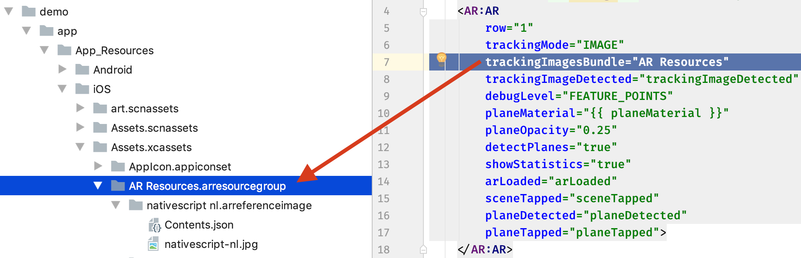

AR view tag options
===================

[🔙](../README.md)

The `<AR>` view tag extends [`ContentView`](https://docs.nativescript.org/api-reference/classes/_ui_content_view_.contentview.html)
which means you can add regular NativeScript properties like `style`, `row`, `col`, and `horizontalAlignment` as usual.

But to help add behavior to the AR experience, here are the properties and events unique to the `<AR>` tag:

## Properties
|property|default|description
|---|---|---
|`trackingMode`|`WORLD`|One of the options in the `ARTrackingMode` enum: `WORLD`, `IMAGE`, `FACE`. Normally, use `WORLD`, but if you want to precisely track images (and replace them in-view with fi. a box, video, or model) then use `IMAGE`.
|`trackingImagesBundle`|`undefined`|Only used when `trackingMode` is `IMAGE`. The bundle of images you want to recognize. See [the demo app](https://github.com/EddyVerbruggen/nativescript-ar/tree/fe10b5afe0442df5a941c66568f0cedbd42124d6/demo/app/App_Resources/iOS/Assets.xcassets/AR%20Resources.arresourcegroup), as well as the screenshot below.
|`debugLevel`|`NONE`|One of the options in the `ARDebugLevel` enum: `NONE`, `WORLD_ORIGIN`, `FEATURE_POINTS`, `PHYSICS_SHAPES`.
|`planeDetection`|`NONE`|To make the plugin detect planes in `WORLD` tracking mode, set this to either `HORIZONTAL` or `VERTICAL` (the latter is not currently supported on Android).
|`showStatistics`|`false`|Draw a few statistics at the bottom.
|`faceMaterial`|-|A `string` referencing a texture for the face when `trackingMode  is `FACE`.  
|`planeMaterial`|-|A `string` referencing a texture for the planes. For instance, the demo uses ['tron'](https://github.com/EddyVerbruggen/nativescript-ar/tree/master/demo/app/App_Resources/iOS/Assets.scnassets/Materials/tron). Can also be a `Color` or `ARMaterial` instance. You won't see the planes if not set.  
|`planeOpacity`|`0.1`|Determines how transparent the planes are, where 0 is invisible, and 1 is 'solid'.

#### trackingImagesBundle


Note that especially on Android detection is a bit picky.
The most important thing is to make sure the image you're trying to recognise in the real world is flat and at least about 15 x 15 centimeters tall.

However, to help Android speed up loading the images you want to track and improve its accuracy you can create an `.imgdb file [like we did here](https://github.com/EddyVerbruggen/nativescript-ar/blob/master/demo-pokemon/App_Resources/Android/src/main/assets/PokemonResources/images.imgdb):

```bash
#build from folder
./arcoreimg build-db --input_images_directory=../demo-pokemon/App_Resources/Android/src/main/assets/PokemonResources/ --output_db_path=../demo-pokemon/App_Resources/Android/src/main/assets/PokemonResources/

#modify -imglist.txt and fix names and append '|0.05' to set width 
#rebuild from list
./arcoreimg build-db --input_image_list_path=../demo-pokemon/App_Resources/Android/src/main/assets/PokemonResources/-imglist.txt --output_db_path=../demo-pokemon/App_Resources/Android/src/main/assets/PokemonResources/
```

## Events
|event|event data|description
|---|---|---
|`arLoaded`|`ARLoadedEventData`|Triggered when the AR view has been drawn.
|`planeDetected`|`ARPlaneDetectedEventData`|Triggered when a new plane was detected.
|`planeTapped`|`ARPlaneTappedEventData`|Triggered when a plane was tapped by the user. Will return the x, y, and z coordinates in the 3D space.
|`sceneTapped`|`ARSceneTappedEventData`|Triggered when a scene was tapped by the user. Will return the x and y screen coordinates.
|`trackingImageDetected`|`ARTrackingImageDetectedEventData`|Only used when `trackingMode` is `IMAGE`. Triggered when one of the images in `trackingImagesBundle` was found. You can make the image interactive in various ways. Currently, I've added the ability to [play a video](https://github.com/EddyVerbruggen/nativescript-ar/blob/a9a0b9e4abcf2f66f16f584eaa754a16fc219d65/demo/app/main-page.ts#L240-L250), [add a model](https://github.com/EddyVerbruggen/nativescript-ar/blob/fe10b5afe0442df5a941c66568f0cedbd42124d6/demo/app/main-page.ts#L165-L189), or [add a box](https://github.com/EddyVerbruggen/nativescript-ar/blob/fe10b5afe0442df5a941c66568f0cedbd42124d6/demo/app/main-page.ts#L192-L224) at the exact spot the image was found. Please request more features, so I know what to build.
|`trackingFaceDetected`|`ARTrackingFaceEventData`|Only used when `trackingMode` is `FACE`. Continuously triggered when a face is detected. Dump the returned `properties` property of the `ARTrackingFaceEventData` object to see what's returned. If you need more properties, let us know. There's also a `faceTrackingActions` which you can use to attach stuff like models and text to the face being tracked. See the demo for an example.

## Continue reading
- [Tell me about the API](api.md)
